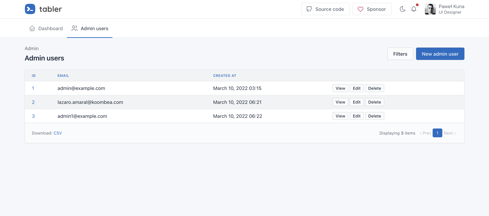

# Administration Zero

The purpose of administration zero is to generate a pre-built administration panel into a rails application.



## Features

- [Beautiful interface](https://github.com/tabler/tabler)
- [Paginated results](https://github.com/ddnexus/pagy)
- [Sortable and filterable](https://github.com/activerecord-hackery/ransack)
- [Exportable data](https://github.com/westonganger/spreadsheet_architect)
- [Toastr for flash messages](https://getbootstrap.com/docs/5.1/components/toasts)
- Show fields with errors in red
- Determine time zone automatically
- Easy authentication system
- Admin scaffolds

## Installation

Add this line to your application's Gemfile:

```ruby
gem "administration-zero"
```

Then run `bundle install`

You'll need to create a model to be administrated, if you don't have one. for this example let's use the following:

```
rails generate model posts title:string body:text published:boolean
```

## Usage

```
rails generate admin:install
```

Then run `bundle install` again

Then run `rails db:migrate db:seed`, you can access the admin panel in `/admin`, using `email: "admin@example.com", password: "Password9957"`


Now you're ready to generate your admin scaffolds.

```
rails generate admin:scaffold posts title:string body:text published:boolean
```

## Development

To release a new version, update the version number in `version.rb`, and then run `bundle exec rake release`, which will create a git tag for the version, push git commits and the created tag, and push the `.gem` file to [rubygems.org](https://rubygems.org).

## Contributing

Bug reports and pull requests are welcome on GitHub at https://github.com/lazaronixon/administration-zero. This project is intended to be a safe, welcoming space for collaboration, and contributors are expected to adhere to the [code of conduct](https://github.com/lazaronixon/administration-zero/blob/master/CODE_OF_CONDUCT.md).

## License

The gem is available as open source under the terms of the [MIT License](https://opensource.org/licenses/MIT).

## Code of Conduct

Everyone interacting in the AdministrationZero project's codebases, issue trackers, chat rooms and mailing lists is expected to follow the [code of conduct](https://github.com/lazaronixon/administration-zero/blob/master/CODE_OF_CONDUCT.md).
